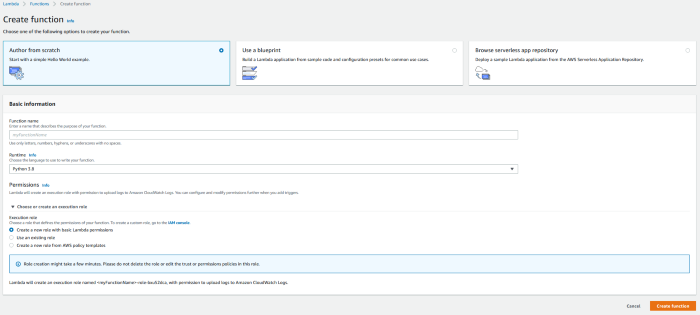
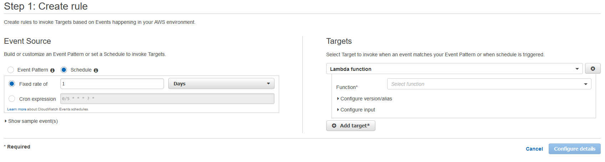
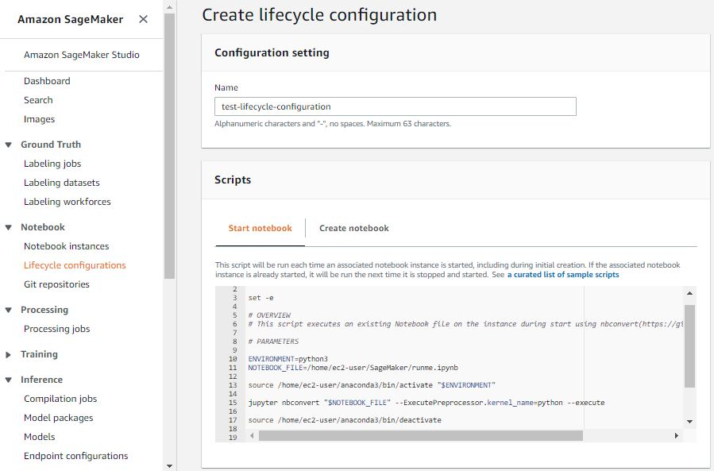
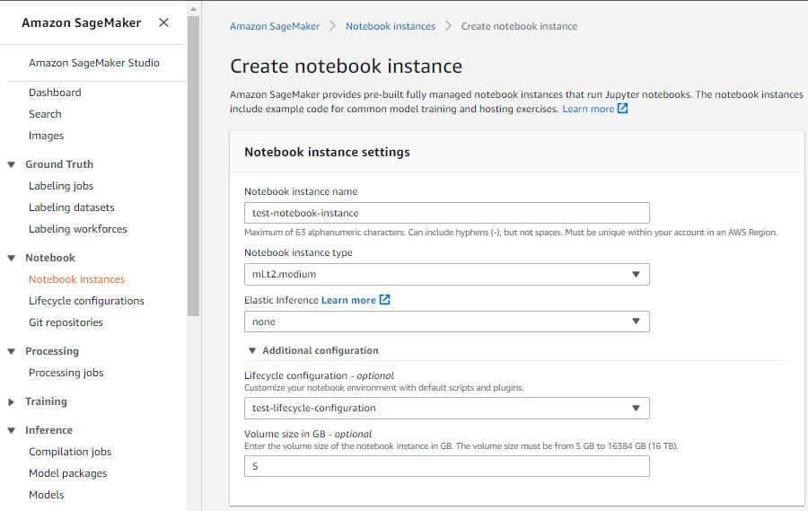
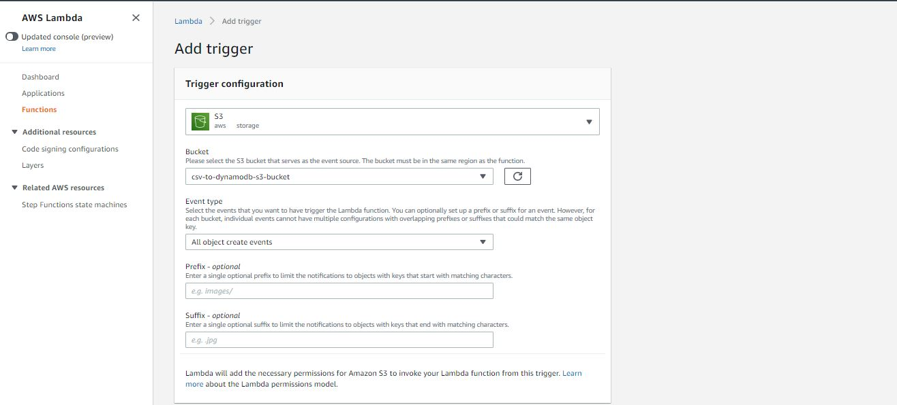
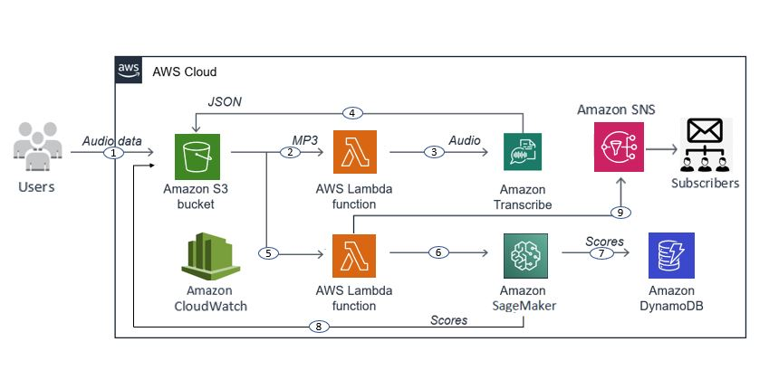

# AWS-Transcribe


Amazon Transcribe provides transcription services for your audio files. It uses advanced machine learning technologies to recognize spoken words and transcribe them into text.


# What you need
  - An AWS account and some basic knowledge working with AWS services.  

The following AWS services will be utilized throughout this guide:
  - AWS Transcribe
  - AWS Lambda
  - Amazon SageMaker
  - AWS S3 (Simple Storage Service)
  - AWS SNS (Simple Notification Service)
  - AWS IAM (Identity Access Management Service)
  - Amazon CloudWatch


# Automating AWS SageMaker notebooks

## Steps used to automate:

 - Use CloudWatch to trigger the execution which calls a Lambda function.
 - The Lambda function starts the respective notebook instance.
 - As soon as the notebook instance starts, the Lifecycle configuration gets triggered.
 - The Lifecycle configuration executes the script and then shuts down the notebook instance.


# Detailed Steps
## Lambda

 - We utilize the Lambda function to start a SageMaker notebook instance. Make sure to choose an execution role that has permissions to access both Lambda and SageMaker.



- On the Function Code, paste this code in the lambda_function.py file in your Lambda function. This code starts the specified notebook instance.   

```python
import json
import boto3

def lambda_handler(event, context):
    print(event)
    client = boto3.client('sagemaker')
    client.start_notebook_instance(NotebookInstanceName='test-notebook-instance')

    return {
        'statusCode': 200,
        'body': json.dumps('Hello from Lambda!')
    }
```

 - Here **‘test-notebook-instance’** is the name of the notebook instance we want to automate.
 

## CloudWatch

- Go to Rules > Create rule.
 

- Enter the frequency of refresh.
- Choose the Lambda function name. This is the same function we created above.


## SageMaker: Lifecycle Configuration

On SageMaker, we will now create a lifecycle configuration for our **‘test-notebook-instance'** notebook instance. Let us call this lifecycle configuration as ‘test-lifecycle-configuration’.




The Code:

```python
#!/bin/bash
set -e

# OVERVIEW
# This script executes an existing Notebook file on the instance during start using nbconvert(https://github.com/jupyter/nbconvert)

# PARAMETERS

ENVIRONMENT=python3
NOTEBOOK_FILE=/home/ec2-user/SageMaker/runme.ipynb

source /home/ec2-user/anaconda3/bin/activate "$ENVIRONMENT"

jupyter nbconvert "$NOTEBOOK_FILE" --ExecutePreprocessor.kernel_name=python --execute

source /home/ec2-user/anaconda3/bin/deactivate

ipython kernel install --user --name=python3
```
This script will be run each time an associated notebook instance is started. The script does the following:
- Start a Python environment
- Execute the Jupyter notebook


After this, we connect the lifecycle configuration to our notebook instance.




## AWS SNS (Simple Notification Service) 

AWS SNS is a web service that enables applications, end-users, and devices to instantly send and receive notifications from the cloud. This service will enable us to get an email with the transcription scores. 

- Create an SNS Topic


- Create and SNS Subscription to send the notification to.


## AWS IAM (Identity Access Management Service) 


- On IAM Roles, attach the SNS Full Access Policy to give AWS Lambda permission to trigger SNS for a notification.

## Lambda 

After the transcription scores have been generated in SageMaker, we need another Lambda function and add an S3 trigger.

- An S3 trigger invokes Lambda once the csv file containing the scores gets uploaded to a designated S3 bucket. 




The Lambda Code:

```python
import datetime
import json
import csv
import boto3

s3_client = boto3.client('s3')
dynamodb = boto3.resource('dynamodb')

table = dynamodb.Table("Transcribe_table")
date_time = datetime.datetime.now() 
current_time = date_time.strftime("%m/%d/%Y, %H:%M:%S")

def lambda_handler(event, context):
    bucket_name = event['Records'][0]['s3']['bucket']['name']
    s3_file_name = event['Records'][0]['s3']['object']['key']
    resp = s3_client.get_object(Bucket = bucket_name, Key = s3_file_name)
    data = resp['Body'].read().decode('utf-8')
    entries = data.split('\n')  
        
    for entry in entries:
        print(entry)
        entry_data = entry.split(",")
            
        # Add it to DynamoDB
        try:
            table.put_item(
            Item = {
                'Filename'  :  entry_data[0],
                 "Accuracy" :  entry_data[1],
                "Index"     :  entry_data[2],
                "Timestamp" :  str(current_time)})
            
        except Exception as e:
            print(str(e))
        
    client = boto3.client('sns')
    response = client.publish(
        TopicArn = 'Your_TopicArn',
        Message = 'Your_Message'
        Subject = 'Your_Subject'
        )
        
    return {
        'statusCode': 200,
        'body': json.dumps('csv to DynamoDB Success!')
    }
```    

The Lambda script does the following:
- SNS - sends an email with the transcription scores to the provided TopicArn. 
- DynamoDB - to write the scores in a DynamoDB table.


# Architecture of the AWS Automated Transcribe Pipeline





Author:
FalakheMshubi@standardbank.co.za   
Developer:
FalakheMshubi@standardbank.co.za
